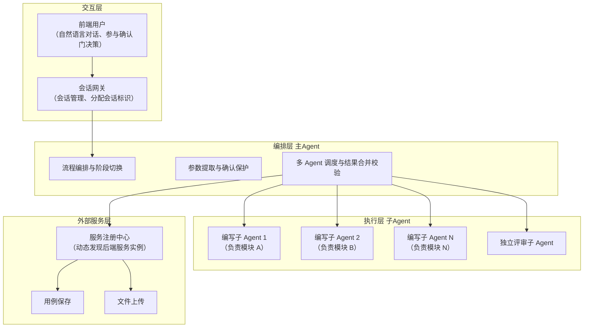
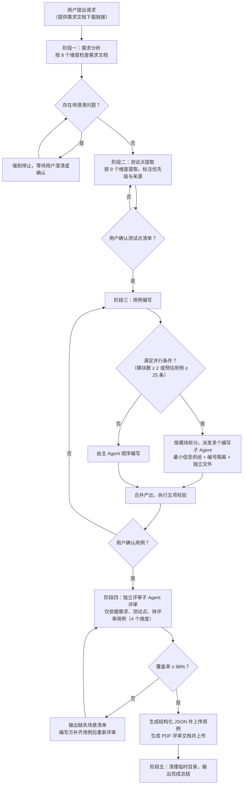
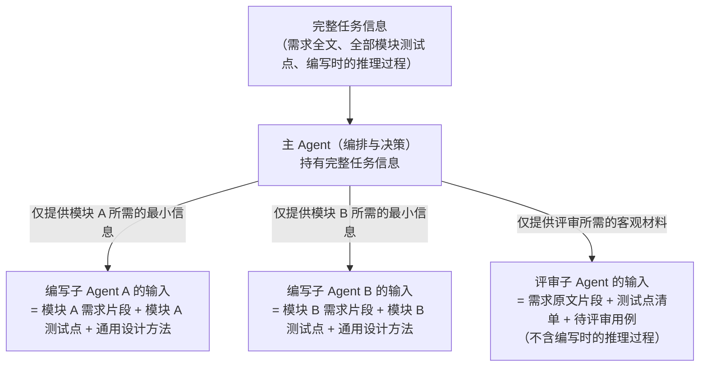

# 技术交底书

**案件名称**：一种基于多 Agent 编排与上下文隔离的测试用例自动生成方法及系统

**技术联系人**：

- 姓名：[待填写]
- 电话：[待填写]
- 邮箱：[待填写]

**专利类型**：发明

---

## 注意事项

（1）交底书应使代理人能看懂，尤其是背景技术和详细技术方案，一定要写得全面、清楚、完整；
（2）技术的公开程度，应以本领域普通技术人员不需付出创造性劳动即可进行实施为准。
（3）在与代理人沟通时，对于代理人咨询的技术问题，应给予回答并认真讲解，并且按要求及时正确地补充相应技术材料。

---

## 术语说明（阅读前请先了解）

本发明涉及大语言模型（LLM）与 AI 智能体（Agent）领域。考虑到该领域术语较多，先以通俗语言对下文中反复出现的关键术语作统一说明，后文不再重复解释。

| 术语                      | 通俗解释                                                                                                                                                                                                                                   |
| ------------------------- | ------------------------------------------------------------------------------------------------------------------------------------------------------------------------------------------------------------------------------------------ |
| 大语言模型（LLM）         | 一类能够理解并生成自然语言的 AI 模型，即常见的"对话式 AI"的底层模型。                                                                                                                                                                      |
| 智能体（Agent）           | 以大语言模型为核心、能自主调用工具并按多个步骤完成一项任务的 AI 应用形态。可通俗理解为"会使用工具、能连续干活儿的对话式 AI 助手"。                                                                                                         |
| 编排（Orchestration）     | 对多个执行单元进行任务分配、顺序控制与结果汇总的管理过程，相当于"调度与指挥"。                                                                                                                                                             |
| 上下文（Context）         | 大语言模型在生成一次回答时能够"看到"的全部输入信息，包括提示词、历史对话、参考资料等。可类比为"AI 回答问题时摆在桌面上的全部资料"。                                                                                                        |
| 上下文窗口                | 大语言模型单次能够处理的输入信息量上限。                                                                                                                                                                                                   |
| 上下文隔离                | 让不同的执行单元只看到各自任务所需的材料、彼此看不到对方的材料，从而避免信息相互干扰。**需特别说明：本发明的"隔离"发生在"信息供给"层面，即通过控制"把哪些信息放入模型的输入"来实现隔离，而不是通过容器、进程、内存等物理手段隔离。** |
| 主 Agent（编排 Agent）    | 负责流程控制与决策的执行单元。它掌握全局信息，但不亲自完成全部具体工作。                                                                                                                                                                   |
| 子 Agent                  | 由主 Agent 派生出来、承担某一具体子任务的独立执行单元。每个子 Agent 拥有自己独立的上下文（即只看得到被分配的那部分信息）。                                                                                                                 |
| 会话（Session）／会话标识 | 一次可持续多轮进行的对话。会话标识是系统为该次对话分配的唯一编号，用于区分不同对话。                                                                                                                                                       |
| 确认门                    | 在流程相邻阶段之间设置的强制人工确认点：未经用户确认，流程不得进入下一阶段。                                                                                                                                                               |
| 覆盖率                    | 已被测试用例覆盖的测试点数量，占测试点总数的百分比：覆盖率 =（已覆盖测试点数 ÷ 测试点总数）× 100%。                                                                                                                                      |
| 服务注册中心              | 一种记录"当前有哪些后端服务实例可用、地址是什么"的目录服务。调用方按服务名查询即可得到健康实例的地址，无需在代码中写死后端地址。                                                                                                           |
| 批次号                    | 同一次生成任务产出的全部用例共用的编号，用于后端追溯这一批数据。                                                                                                                                                                           |

> 阅读提示：若只想了解技术方案本身，可重点阅读第三节；其中 3.4.1 至 3.4.4 为本发明的四个核心创新点。

---

## 一、介绍相关技术背景，描述与本发明技术最相近的现有技术，并说明该现有技术存在的缺点

### 1.1 现有技术

本方案属于**软件测试自动化与人工智能辅助软件开发**交叉领域，具体涉及利用大语言模型（LLM）与多个 AI 智能体（Agent）协作、自动生成**功能测试用例**的技术。

随着软件交付节奏加快，人工编写测试用例已成为研发链路中的瓶颈：测试工程师需要从需求文档中逐条提取测试点、设计边界值与异常场景、编写可执行的测试步骤，工作量大，且质量高度依赖个人经验。因此，利用大语言模型自动生成测试用例成为近年来的研究与应用热点。

经检索（检索渠道：国家知识产权局中国专利公布公告站 epub.cnipa.gov.cn；检索词覆盖"多智能体 测试用例""测试用例 自动生成""大模型 测试用例""上下文隔离 子任务""用例评审 覆盖率""会话隔离 多轮对话""多智能体 评审 循环"等），按技术方向分类，与本案最相近的现有技术如下。

**方向一：多智能体协作生成测试用例**

1. **CN122633561A「联调测试方法、装置、设备、存储介质及产品」**

   - 技术方案：获取目标软件系统的变更需求信息，通过第一智能体结合测试知识库生成测试用例；通过第二智能体确定联调测试所需的模块调用拓扑并搭建测试环境；通过第三智能体在测试环境执行用例得到测试结果。
   - 应用场景：多业务模块系统的联调测试用例生成与执行。
   - 局限性：三个智能体按"生成—搭环境—执行"作功能分工，智能体之间没有对"各自能看到哪些信息"作供给约束，因而未能解决单个智能体处理信息过多、到任务后段产出质量下降的问题；同时没有独立的评审环节，用例质量依赖生成智能体自身能力，存在"自己审自己"的盲区。
   - 来源链接：http://epub.cnipa.gov.cn/patent/CN122633561A
2. **CN122633558A「一种基于标记语言的自动化测试用例生成方法及系统」**

   - 技术方案：获取原始测试需求文本，进行标记语言编写得到处理后的需求信息，基于操作指令、参数约束、流程逻辑及数据依赖确认流程拓扑图，进而确认目标测试场景与测试步骤序列，按环境准备步骤集、操作执行步骤集、结果校验步骤集生成子测试用例并汇总。
   - 应用场景：面向需求文档的自动化测试用例生成。
   - 局限性：采用单条流程顺序生成，未涉及多执行单元并行编排；没有按模块作信息隔离；生成结果没有独立评审与闭环校验；面对大规模多模块需求时，用例质量与效率受限于单次生成链路。
   - 来源链接：http://epub.cnipa.gov.cn/patent/CN122633558A

**方向二：多智能体上下文隔离与协同处理**

3. **CN122506934A「一种基于上下文隔离多智能体架构的无人机管控系统及方法」**

   - 技术方案：构建应用层（多个上下文完全隔离的任务智能体）、能力层（多个与应用层上下文隔离的能力智能体）、框架层（为智能体分配独立运行时容器与内存空间，不同智能体间仅通过隔离网关开放授权通信端口实现物理隔离）及外部工具层四级架构，通过三级上下文隔离机制将单一智能体承载的全链路管控任务拆分为多智能体分域承载模式，宣称单智能体上下文负载降低 90% 以上。
   - 应用场景：无人机集群管控等实时性、可靠性要求高的任务领域。
   - 局限性：其上下文隔离采用**物理/运行时级隔离**（容器、内存、通信端口），面向实时管控场景；隔离的粒度与本发明"控制向模型提供哪些信息"的做法不同，且未涉及测试用例生成领域的任务拆分、编号隔离与产出合并校验，也没有评审闭环。
   - 来源链接：http://epub.cnipa.gov.cn/patent/CN122506934A
4. **CN122635406A「一种面向数据处理任务的多智能体框架及处理方法」**

   - 技术方案：构建含规划智能体、代码生成智能体和 SQL 生成智能体的多智能体系统，多智能体间采用分层反思的协同工作机制；规划智能体执行全局上下文检索，将复杂代码/SQL 生成与调试任务委托给独立智能体执行，通过分层反思机制动态调整任务规划，避免无限调试循环，通过上下文隔离与职责分离提升复杂数据处理任务的完成率。
   - 应用场景：数据处理、代码/SQL 生成与调试任务。
   - 局限性：面向数据处理任务，其"反思"是生成智能体自身的分层反思，并非由一个信息受限的独立评审角色来审查；没有覆盖率等量化判定标准与循环回补机制；未涉及测试用例生成及会话级状态管理。
   - 来源链接：http://epub.cnipa.gov.cn/patent/CN122635406A
5. **CN122470378A「一种面向大语言模型 Agent 工具调用的结构化数据上下文隔离寻址与多层缓存分析方法、装置及电子设备」**

   - 技术方案：调用数据获取工具获取结构化数据集合，基于数据集合索引 Key 并发启动多条相互独立的分析轨道，分析结果存储至持久化索引层与对象存储层并生成分析结果标识 Key，服务端基于各轨道标识 Key 自主读取并合并生成综合分析报告，解决上下文窗口污染、跨工具数据传递冗余、缓存机制缺失与断点续传问题。
   - 应用场景：LLM Agent 工具调用与数据分析。
   - 局限性：其隔离对象是"数据分析轨道"，而非"向各生成任务执行单元供给哪些信息"；面向分析报告生成，与测试用例生成、独立评审闭环没有直接关联。
   - 来源链接：http://epub.cnipa.gov.cn/patent/CN122470378A
6. **CN122633326A「一种基于国产软硬件环境的多智能体协同处理方法及系统」**

   - 技术方案：在国产处理器与操作系统环境下对多智能体任务统一规划，引入算子约束规则与算子支持映射表限制/替换模型结构，采用轻量级模型先行生成候选结果、主模型融合的双阶段生成方式，执行阶段按有向无环图形式的任务执行结构调用工具完成多智能体协作。
   - 应用场景：国产软硬件环境下的多智能体任务协同。
   - 局限性：关注算子级适配与任务依赖结构，未涉及测试用例领域的"按模块最小信息供给"、独立评审与阶段间确认门流程控制。
   - 来源链接：http://epub.cnipa.gov.cn/patent/CN122633326A

**方向三：AI 辅助测试用例评审与质量评估**

7. **CN122635311A「一种基于大模型的多维 AI 专家评审方法」**

   - 技术方案：切分评审规则压成评审标尺超盒簇，定位待评文件层级剥离证据形成证据粒元，驱动大模型专家角色审阅证据粒元形成专家意见粒元，通过改进的模糊最小最大神经网络模型压接同位边界、归并同源证据、标记边界冲突，经超盒咬合锁分机制执行牵引收缩与失格锁止，制成综合评审结果、证据回链关系与复核标记。
   - 应用场景：文件/证据类材料的智能评审。
   - 局限性：评审对象为文件与证据材料，评审机制为神经网络超盒模型；未涉及测试用例评审中"刻意不让评审方看到作者推理过程"的信息隔离思想，也没有覆盖率量化判定与回补循环。
   - 来源链接：http://epub.cnipa.gov.cn/patent/CN122635311A
8. **CN122220213A「一种软件自动化测试方法及系统」**

   - 技术方案：整合 UI、接口文档、测试用例和数据库文档，基于大模型生成测试数据得到数据库，在数据库中构建前置执行条件后对用例进行评审和修改得到新数据库，再结合 dump 文件进行分析，以解决用例质量不可控与测试用例提前校正问题。
   - 应用场景：软件自动化测试中用例数据准备与质量校正。
   - 局限性：评审与修改在**同一条生成链路内**完成，属"自评自改"，没有独立的评审角色与信息裁剪；也没有"覆盖率 ≥ 阈值"的量化通过标准与循环评审机制。
   - 来源链接：http://epub.cnipa.gov.cn/patent/CN122220213A
9. **CN122086787A「基于标签树的 AI 辅助工具的评估方法及系统」**

   - 技术方案：针对 AI 辅助工具生成的每个测试用例创建来源标签对象及来源标签树，通过标签状态记录用例生成事件与评审事件的评估参数，在评审完成时基于第一、第二评估参数生成评估指标，统计周期结束时生成第二评估指标并输出评估结果。
   - 应用场景：AI 测试用例生成工具的效能评估。
   - 局限性：用于"工具效能评估"而非"用例质量闭环保障"，通过标签树事后统计，没有"评审通过前的回补循环"，不改变用例本身的生成与评审流程。
   - 来源链接：http://epub.cnipa.gov.cn/patent/CN122086787A

**方向四：AI 测试与代码质量管理（相关）**

10. **CN122633543A「一种代码集成管理与自动化测试系统及方法」**

    - 技术方案：一体化工作流引擎监听代码仓库变更事件，并行触发传统质量检测流程与智能质量预测流程；智能质量预测模块提取多维度特征向量并利用机器学习模型生成质量风险分数/风险标签；智能资源调度器依据质量风险分数动态分配测试计算资源，并将风险分数集成至代码评审工具界面。
    - 应用场景：代码集成管理、质量风险预测与测试资源调度。
    - 局限性：围绕代码变更的质量预测与资源调度，未涉及测试用例的多执行单元编排生成、评审闭环与阶段间确认门。
    - 来源链接：http://epub.cnipa.gov.cn/patent/CN122633543A
11. **CN122635843A「基于组件化配置驱动的数字员工多模式协同方法和系统」**

    - 技术方案：建立组件注册中心标准化组件，按配置需求加载组件，按工作模式创建差异化工作区，调用标准化组件处理并沿数据流实施安全防御，检测内容类型多模态渲染并分类存储，通过语义匹配引擎触发外部事件响应；提及精细化的会话隔离与高复用技能组合。
    - 应用场景：企业级数字员工（AI 服务）多模式协同。
    - 局限性：其会话隔离停留在"工作区"这一较粗的层级，未细化到"会话标识隔离目录 + 文件即状态 + 批次号追溯"的任务状态管理，也未涉及测试用例生成流程。
    - 来源链接：http://epub.cnipa.gov.cn/patent/CN122635843A
12. **CN122635349A「基于意图关系约束与执行反证闭环的意图识别方法」**

    - 技术方案：对用户输入进行语义识别得到多个候选意图，按意图关系约束重排得到意图组合结果，调用执行工具执行并判断是否触发反证行为，将反证信息作为后验信息调整候选意图并重排得到修正结果。
    - 应用场景：多轮对话场景下的意图识别与修正。
    - 局限性：其"反证闭环"针对对话意图识别，用于多轮对话中用户指代模糊时的纠偏，与测试用例评审闭环在对象、判定标准与应用领域上均不同。
    - 来源链接：http://epub.cnipa.gov.cn/patent/CN122635349A

**检索总结**：上述现有技术分别覆盖了多智能体分工生成测试用例（CN122633561A）、标记语言用例生成（CN122633558A）、物理级上下文隔离（CN122506934A）、分层反思协同（CN122635406A）、AI 专家评审（CN122635311A）、自评自改用例校正（CN122220213A）、工具效能标签评估（CN122086787A）等方向，但**均未披露**以下组合技术方案：以"信息供给层面的最小上下文隔离"驱动多个编写子 Agent 并行编写、以"向独立评审子 Agent 刻意隐藏作者推理过程"实现无偏见评审、以覆盖率阈值形成闭环回补、以强制确认门约束跨阶段推进、以会话隔离与"文件即状态"实现跨轮次可恢复。

### 1.2 现有技术存在的缺点

综合上述检索结果，现有技术主要存在以下缺点：

1. **单个智能体处理信息过多，导致任务后段产出质量下降**：现有生成方案（CN122633558A、CN122220213A 等）多由单个智能体或单条流程承载完整任务；当需求覆盖多个模块、用例量较大时，模型在一次任务中需要"看到"的信息持续累积，对每一部分的注意力被稀释，后期生成的用例在步骤具体性、边界覆盖上质量明显下降。CN122506934A 虽提出了上下文隔离，但属于容器/内存级物理隔离，面向实时管控领域，未给出面向"用例生成任务"的按模块拆分与最小信息供给方案。
2. **AI 自己评审自己，存在固有盲区**：现有评审方案（CN122220213A 的"自评自改"）由生成链路的同一角色完成评审，编写时的思维惯性会带入评审（例如"我这样写是因为当时考虑过 X"），使得步骤模糊、数据缺失、覆盖率虚高等问题难以被发现；CN122635311A 的评审对象为文件证据，机制复杂且未针对测试用例，也未提出"刻意排除作者推理过程"的信息隔离评审思想。
3. **缺乏量化判定与闭环回补**：现有方案（CN122086787A 的标签树评估）多为事后统计评估，没有"覆盖率 ≥ 阈值 → 不通过则列出缺失场景 → 补充用例 → 重新评审"的循环机制，无法保证交付的用例真正覆盖全部测试点。
4. **AI 跨阶段自主推进导致错误累积**：现有一次性串行/并行流程缺少阶段之间的人工决策门，AI 在需求尚未澄清、测试点尚未确认的情况下就继续向下推进，导致错误假设在后续阶段不断累积放大。
5. **多轮会话的状态管理不完备**：现有方案（CN122635843A）的会话隔离停留于工作区层级，未实现"会话标识隔离目录 + 文件即状态 + 批次号追溯"，跨轮次对话恢复、并发会话隔离、产出批次追溯能力不足；并且存在"评审通过前即生成并上传结构化数据"的脏数据风险。

---

## 二、针对上述缺点，说明本发明所要解决的技术问题

针对现有技术存在的上述缺点，本发明所要解决的技术问题包括：

1. **如何在大规模多模块需求下保持测试用例生成质量的稳定性**——按模块拆分生成任务，并只向每个编写子 Agent 提供该模块所需的最小信息（该模块的需求片段 + 该模块的测试点 + 通用测试设计方法），使单个执行单元的处理信息量可控、对单一模块的思考更充分，从而解决"信息过多导致任务后段质量下降"的问题。
2. **如何消除 AI 用例评审的自我审查盲区**——引入与编写角色完全分离的独立评审子 Agent，并对其输入信息进行刻意裁剪（只包含需求原文片段 + 测试点清单 + 待评审用例，排除编写者的推理过程），实现无偏见的独立审查。
3. **如何以量化标准保障用例覆盖并形成闭环**——以"覆盖率 ≥ 98%"作为评审通过阈值；不通过时由评审方列出缺失场景清单（每条含场景描述、优先级、建议用例标题、测试数据示例），编写方补充后重新评审，循环直至通过；对极难构造或极低概率的场景允许豁免，但必须说明原因。
4. **如何约束 AI 的跨阶段自主性**——在需求分析、测试点提取、用例编写、用例评审与上传等阶段之间设置强制确认门，将 AI 的自主性约束在单个阶段内，跨阶段的决策权交还人类，避免错误逐级累积。
5. **如何实现多轮会话的可恢复状态管理与数据质量保障**——以会话标识隔离临时目录、以"文件即状态"把各阶段产出落盘，支持跨轮次恢复与并发会话隔离；以批次号串联同一批产出供后端追溯；仅在评审通过后才生成结构化数据并上传，避免脏数据入库。

---

## 三、本发明技术方案的详细阐述

### 3.1 技术方案概述

本方案面向**基于大语言模型的功能测试用例自动生成**场景。系统通过对话式接口接收用户提供的需求文档（PDF/DOCX），依次完成需求分析、测试点提取、用例编写、用例评审与上传，最终交付两种产物：供人阅读与评审的**用例文档**（Markdown/PDF），以及供后端入库的**结构化数据**（JSON）。

**一句话概括本方案的核心思想**：用"主 Agent 编排 + 子 Agent 执行"的组织方式，把一个大任务拆给多个执行单元；每个执行单元只看得到与自己相关的最小信息；评审由独立的、看不到作者思路的执行单元完成，并以量化标准形成回补闭环；阶段之间的推进权交还人类。由此，AI 的创造力被引导到"单阶段的深度执行"上，跨阶段的决策权则交给人类，从而在商业场景下获得可预期的产出质量。

本方案的运行载体与前提条件如下：

- 用户通过前端以自然语言对话方式提出请求；平台侧的**会话网关**负责把同一轮对话中的多条消息归入同一个"会话"，并为每个会话分配唯一标识，从而支持多轮对话的连续进行；
- 智能体不写死后端服务地址，而是通过**服务注册中心**（记录可用后端服务实例地址的目录服务）动态查询并选取健康实例，完成用例与文档的上传；
- 智能体只承担"编写功能测试用例"这一项职责，明确不涉及测试计划、测试策略、自动化脚本生成等其他测试活动，以保证流程边界清晰、执行聚焦。

### 3.2 系统框图

系统整体划分为**交互层、编排层、执行层与外部服务层**四个层次，系统框图如下：

### 3.3 模块功能说明

**（1）交互层**

- **前端用户**：以自然语言对话方式提出请求（例如提供需求文档下载链接），并参与各阶段的确认门决策。
- **会话网关**：负责会话管理，为每个会话分配唯一会话标识并保持多轮对话的连续性，是智能体与前端之间的唯一入口。

**（2）编排层（主 Agent）**

- **流程编排与阶段切换**：将整个任务划分为需求分析、测试点提取、用例编写、用例评审与上传、清理总结五个阶段，按"阶段递进 + 人工确认门"的方式组织，并控制阶段之间的流转。
- **参数提取与确认保护**：从用户请求中提取关键参数（如需求文档地址、文件格式）；在"待澄清问题未解决""测试点未确认""用例未确认""评审未通过"等情况下，禁止进入下一阶段，强制等待用户决策。
- **多 Agent 调度与结果合并校验**：负责派发并行的编写子 Agent，汇总各子 Agent 的产出，并对合并结果执行五项校验（编号唯一、覆盖率 100%、无冗余、模块完整、数据具体）；随后触发独立评审子 Agent，并依据其结论决定回补还是放行。

**（3）执行层（子 Agent）**

- **编写子 Agent（按模块拆分）**：每个编写子 Agent 只接收它负责的那个模块的需求片段、该模块的测试点清单与通用测试设计方法，在隔离的上下文中编写该模块的用例，并写入独立文件；用例编号按模块标识隔离（如 `TC-模块A-001`），因此不同子 Agent 的编号天然不会冲突。
- **独立评审子 Agent**：与编写角色完全分离，其输入信息被刻意裁剪为三样东西——"需求原文片段 + 测试点清单 + 待评审用例"，不包含任何编写者的推理过程；它按完整性、准确性、有效性、可执行性四个维度严格评审，输出覆盖率数据与明确的"通过/不通过"结论。

**（4）外部服务层**

- **服务注册中心**：提供后端服务实例的动态发现；系统从实例列表中筛选健康实例并据此构建调用地址，实现环境无关、可移植的地址解析。
- **用例保存**：接收评审通过后的结构化用例 JSON 数据并入库。
- **文件上传**：接收评审报告、待澄清需求清单等 PDF 文档。

### 3.4 系统流程说明

系统整体流程如下：

**流程说明**：

- **阶段一（需求分析）**：下载需求文档，按 8 个维度框架（功能完整性、逻辑一致性、边界清晰度、可测试性、数据完整性、异常处理、依赖关系、性能要求）系统检查文档，将每项标记为"明确/模糊/缺失"。**一旦发现待澄清问题即强制停止**，禁止自动进入阶段二。
- **阶段二（测试点提取）**：按 8 个维度（功能、数据、场景、非功能、组合、状态转换、并发、依赖）逐段阅读需求并提取测试点；每个测试点标注需求来源（需求第 X 段）与优先级（0/1/2）及风险等级。测试点清单需经用户确认后才进入阶段三。
- **阶段三（用例编写）**：应用 8 种测试设计方法（等价类划分、边界值分析、判定表法、因果图法、状态迁移测试、场景法、正交试验设计、错误推测法），并叠加表单场景规则与集成场景规则编写用例；满足并行条件时按模块拆分、并行执行（最小信息供给、编号隔离、独立文件），合并后执行五项校验。
- **阶段四（用例评审与上传）**：由独立评审子 Agent 按 4 个维度评审；覆盖率 ≥ 98% 视为通过，否则列出缺失场景回补并重审；通过后生成 JSON 并上传用例，同时生成 PDF 文档并上传。
- **阶段五（清理与总结）**：统一清理会话临时目录，输出完成总结（含用例统计与文档链接）。

#### 3.4.1 核心创新点一：按模块拆分与最小信息供给的并行编写编排

当测试点覆盖 ≥ 2 个模块，或预估用例 ≥ 25 条时，主 Agent 启用并行编写。其原理是：大语言模型在一次任务中能处理的信息量有上限，信息越多、对每一部分的注意力越分散，后段产出质量越容易下降；因此本方案不让一个执行单元处理全部模块，而是拆而治之。

1. **按模块拆分**：以测试点清单中的 `## [模块名称]` 为边界，将任务拆分为若干相互独立的编写单元；
2. **最小信息供给**：每个编写子 Agent 的输入只包含四项——该模块的需求片段、该模块的测试点清单（含优先级与来源标注）、通用测试设计方法、用例字段定义，**不包含其他模块的信息**。信息越精简，该子 Agent 对本模块的思考越充分；
3. **编号防冲突**：用例编号格式为 `TC-[模块标识]-[序号]`，模块标识天然隔离了编号空间，并行编写不会产生重复编号；
4. **独立持久化**：每个编写子 Agent 将产出写入独立的 Markdown 文件，由主 Agent 统一合并；
5. **并行上限**：同时运行的编写子 Agent 不超过 3 个，超出的部分排队顺序执行；
6. **合并后五项校验**：编号唯一、覆盖率 100%（每个测试点均有用例覆盖）、无冗余（同一测试点不被多个用例重复覆盖）、模块完整（所有模块均已编写）、数据具体（抽查用例步骤是否使用了具体输入值而非模糊描述）。

以下示意图直观说明"最小信息供给"与"独立评审信息裁剪"的做法：

#### 3.4.2 核心创新点二：基于信息裁剪的无偏见独立评审

1. **角色分离**：独立评审子 Agent 与编写子 Agent 完全分离，其角色设定为"独立测试用例评审专家"；
2. **信息裁剪**：评审子 Agent 的输入**只包含三样东西**——需求原文片段、测试点清单、待评审用例，**刻意排除主 Agent 与编写子 Agent 编写用例时的推理过程**。这样，评审方无法以"作者视角"为用例辩护，天然地从"执行者"的角度审视用例；
3. **四维度评审**：
   - 完整性——覆盖率 ≥ 98%，且包含正向、异常、边界场景；
   - 准确性——预期结果与需求一致、测试数据具体、用例编号规范；
   - 有效性——用例能发现缺陷、无冗余、遵循原子性原则；
   - 可执行性——步骤清晰、给出具体输入值、前置条件可验证、可独立执行；
4. **闭环循环**：评审不通过时，评审方输出缺失场景清单（每条含场景描述、优先级、建议用例标题、测试数据示例），编写方补充用例后重新触发评审，循环直至通过；对覆盖率尚缺的不足 2% 部分可予豁免，但必须逐项说明豁免原因（极难构造环境、极低概率场景、需求未明确）。

#### 3.4.3 核心创新点三：阶段间强制确认门与阶段解耦

- **确认门设置**：各阶段之间设有强制确认门——阶段一有待澄清问题时禁止进入阶段二；阶段二的测试点清单需用户确认；阶段三的用例需用户确认；阶段四评审通过后才触发生成与上传；
- **设计目的**：把 AI 的自主性约束在单个阶段内，把跨阶段的决策权交给人类，避免"AI 自行假设答案继续向下走"导致的错误累积；
- **配套机制**：
  - **方法论固化**——需求分析 8 维度、测试点提取 8 维度、用例编写 8 种方法、用例评审 4 维度，将隐性的测试经验显性化为可执行的检查清单；
  - **脚本固化**——将下载、上传、格式转换等易错的输入输出（IO）操作固化为独立脚本（内置重试、编码处理、异常捕获），把不确定性从 Agent 的自主决策中剥离出来。

#### 3.4.4 核心创新点四：会话隔离与"文件即状态"的跨轮次状态管理

- **会话标识隔离**：所有临时文件统一存放于以会话标识命名的隔离目录中，不同会话互不干扰，因而支持并发会话；
- **文件即状态**：不依赖运行内存保存状态，各阶段产出（需求文档、测试点清单、用例 Markdown、结构化 JSON）均落盘持久化，因此跨轮次对话可以从中断处恢复；
- **批次号追溯**：生成 17 位批次号（年月日时分秒毫秒），同一批次的所有用例共享该批次号，便于后端追溯；
- **上传时机约束**：仅在评审通过后才生成结构化 JSON 并上传，避免"评审未通过就上传脏数据"；
- **统一清理**：流程结束后统一清理会话目录，不残留中间文件。

### 3.5 关键技术参数

| 参数           | 含义                        | 取值/约束                                                                                                                             |
| -------------- | --------------------------- | ------------------------------------------------------------------------------------------------------------------------------------- |
| 并行触发条件   | 启用并行编写的阈值          | 涉及 ≥ 2 个功能模块，或预估用例 ≥ 25 条                                                                                             |
| 并行上限       | 同时运行的编写子 Agent 数量 | ≤ 3 个，超出部分排队顺序执行                                                                                                         |
| 用例编号格式   | 用例唯一编号规则            | `TC-[模块标识]-[序号]`，如 `TC-User-001`                                                                                          |
| 合并校验项     | 合并后必须通过的检查        | 编号唯一、覆盖率 100%、无冗余、模块完整、数据具体（共 5 项）                                                                          |
| 评审通过阈值   | 评审通过的覆盖率下限        | ≥ 98%                                                                                                                                |
| 覆盖率计算方式 | 覆盖率的定义                | 覆盖率 =（已覆盖测试点数 ÷ 测试点总数）× 100%                                                                                       |
| 豁免比例       | 允许未覆盖的比例            | < 2%，且必须逐项说明豁免原因                                                                                                          |
| 评审维度       | 独立评审的检查维度          | 完整性、准确性、有效性、可执行性（共 4 项）                                                                                           |
| 需求分析维度   | 需求文档检查框架            | 功能完整性、逻辑一致性、边界清晰度、可测试性、数据完整性、异常处理、依赖关系、性能要求（共 8 项）                                     |
| 测试点提取维度 | 测试点扫描框架              | 功能、数据、场景、非功能、组合、状态转换、并发、依赖（共 8 项）                                                                       |
| 测试设计方法   | 用例编写方法论              | 等价类划分、边界值分析、判定表法、因果图法、状态迁移测试、场景法、正交试验设计、错误推测法（共 8 种），另加表单场景规则与集成场景规则 |
| 优先级         | 用例优先级                  | 0（核心/高风险）、1（常用/中风险）、2（辅助/低风险）                                                                                  |
| 批次号         | 同批产出标识                | 17 位数字（yyyyMMddHHmmssSSS）                                                                                                        |
| 上传时机       | 结构化数据入库时机          | 仅在评审通过之后                                                                                                                      |

---

## 四、与现有技术相比，本发明具有哪些优点？

1. **用例质量稳定性显著提升**：通过"按模块拆分 + 最小信息供给"，单个执行单元的处理信息量可控，从根本上缓解"信息过多导致任务后段用例质量下降"的问题；编号隔离与合并后五项校验则保证了多个执行单元产出的有序合并与全面覆盖。与 CN122633558A（单一链路顺序生成）和 CN122506934A（物理级隔离、面向实时管控）相比，本发明采用的是"信息供给层面"的隔离，且直接服务于用例生成质量。
2. **评审无偏见、可量化、闭环化**：独立评审子 Agent 的信息裁剪使评审方无法从作者视角自我辩护，克服了 CN122220213A"自评自改"的固有盲区；"覆盖率 ≥ 98% 阈值 + 缺失场景清单 + 回补循环"使覆盖保障可量化、可迭代，优于 CN122086787A 的事后统计评估。
3. **平衡了 AI 自主性与人类决策权**：强制确认门把 AI 自主性约束在单个阶段内，跨阶段决策权归人类，避免错误假设累积；方法论固化（需求分析 8 维度、测试点 8 维度、用例 8 方法、评审 4 维度）保证每次执行遵循同一标准，产出质量稳定、可复现。
4. **状态管理完备、数据质量可控**："会话标识隔离 + 文件即状态"支持跨轮次恢复与并发会话隔离；批次号支持后端追溯；"评审通过后才上传"避免脏数据入库，优于 CN122635843A 的工作区级会话隔离。
5. **环境无关、输入输出行为可预期**：服务注册中心动态发现后端实例，无需硬编码地址；下载、上传、格式转换等易错 IO 操作被固化为脚本（内置重试、编码处理、异常捕获），把不确定性从 Agent 的自主决策中剥离，使 IO 行为可预期。

---

## 五、本发明的技术关键点和欲保护点

1. **基于最小信息供给的并行用例编写方法**：按模块拆分测试用例生成任务，每个编写子 Agent 只获得该模块的需求片段、测试点清单与通用设计方法，用例编号按模块标识隔离，合并后执行编号唯一、覆盖率 100%、无冗余、模块完整、数据具体五项校验（具体实现见 3.4.1）。
2. **基于信息裁剪的无偏见独立评审方法**：评审子 Agent 与编写角色分离，其输入被刻意裁剪为"需求原文片段 + 测试点清单 + 待评审用例"三要素（排除编写者的推理过程），并按完整性、准确性、有效性、可执行性四个维度评审（具体实现见 3.4.2）。
3. **基于覆盖率阈值的闭环回补方法**：以覆盖率 ≥ 98% 作为通过标准；不通过时由评审方输出缺失场景清单（含场景描述、优先级、建议用例标题、测试数据示例），编写方补充后重新评审直至通过；不足 2% 的部分可豁免但须说明原因（具体实现见 3.4.2）。
4. **基于强制确认门的阶段解耦方法**：在需求分析、测试点提取、用例编写、评审上传各阶段之间设置强制确认门，将 AI 自主性约束在单个阶段内，跨阶段决策权交还人类，避免错误累积（具体实现见 3.4.3）。
5. **基于会话隔离与"文件即状态"的跨轮次状态管理方法**：以会话标识隔离临时目录、以文件即状态落盘各阶段产出、以批次号串联同一批产出、仅在评审通过后才生成并上传结构化数据（具体实现见 3.4.4）。
6. **多 Agent 编排的整体系统**：主 Agent（流程编排、阶段切换、参数提取、确认门守卫、结果合并校验）与子 Agent（并行编写 ×N、独立评审）的组织架构，以及交互层、编排层、执行层、外部服务层的层次化系统结构（见 3.2、3.3）。

---

## 六、其它（实施例、技术效果、参数示例）

### 实施例：多模块业务系统的功能测试用例生成

**应用场景**：某业务系统包含用户管理、订单管理、支付模块三个功能模块，需求文档为 PDF 格式，要求生成覆盖全部模块的功能测试用例。

**已知条件**：

- 需求文档：单一 PDF，包含三个模块的功能描述、表单字段定义与业务规则；
- 测试点规模：三个模块共提取约 30 个测试点，预估用例数 ≥ 25 条，满足并行触发条件；
- 运行环境：AI 服务平台上的智能体实例，通过会话网关接入，后端服务通过服务注册中心发现。

**系统流程简述**：

1. 用户通过对话提供需求文档链接，会话网关为该次对话分配唯一会话标识；
2. 进入阶段一：下载需求文档并按 8 个维度分析，输出维度评估表与关键业务规则；本实施例需求无待澄清问题，进入阶段二；
3. 阶段二按 8 个维度提取 30 个测试点（含优先级与来源标注），经用户确认后进入阶段三；
4. 阶段三检测到 3 个模块、预估 30 条用例，满足并行条件，启用并行编写：三个编写子 Agent 分别获得"用户管理 / 订单管理 / 支付模块"的最小信息（模块需求片段 + 模块测试点 + 通用设计方法），并行编写并写入各自独立文件，用例编号分别为 `TC-User-001…`、`TC-Order-001…`、`TC-Pay-001…`；主 Agent 合并后执行五项校验，全部通过；
5. 阶段四由独立评审子 Agent 仅接收"需求原文 + 测试点清单 + 合并用例"，按 4 个维度评审；若覆盖率初评为 96%（某支付边界场景缺失），则输出缺失场景清单（含建议用例标题"验证支付金额超出单笔限额提示"与测试数据示例"单笔限额 5000 元，输入 5000.01 元"），编写子 Agent 补充后重新评审，直至覆盖率 100%；
6. 评审通过后，生成带批次号的结构化 JSON 并上传至用例保存接口，同时生成评审报告 PDF 并上传至文件上传接口；
7. 阶段五清理临时目录，输出完成总结。

**技术效果**：

- 三个模块的用例由三个信息隔离的编写子 Agent 并行产出，单个子 Agent 的输入仅含本模块信息，用例步骤的具体性抽查通过率明显高于单 Agent 顺序生成的后段用例；
- 独立评审发现并回补了支付边界场景的缺失，最终覆盖率 100%，评审通过；
- 全程跨阶段决策（测试点确认、用例确认、评审结论）均由用户与评审门把关，无错误假设跨阶段累积；
- 会话中断后，可从已落盘的阶段产出恢复继续，无需从头开始。

**参数设置示例**（不作为权利要求限制）：

- 并行触发阈值：模块数 ≥ 2，或预估用例 ≥ 25 条；
- 并行上限：3 个；
- 评审通过阈值：覆盖率 ≥ 98%；
- 豁免上限：< 2%；
- 批次号：17 位（yyyyMMddHHmmssSSS）；
- 用例编号：`TC-[模块标识]-[序号]`。

---

## 七、本项目的技术方案是否还有其他可替代的方案达到相同的技术目的

**说明**：本发明的技术目的是——在多模块、大规模需求下稳定地自动生成高质量功能测试用例，并通过独立评审、量化闭环与可控推进保证交付质量。凡能达到相同技术目的的实现方式，均属于本发明的可替代方案。替代既可以发生在**部分环节**（某个结构、器件或方法步骤的替换），也可以是**整体技术方案**的替换。

以下按第五节各保护点分类给出替代方案，并补充整体替代方案，以便扩大保护范围、防止他人以等效手段绕过本发明。

**（一）整体技术方案的替代**

1. **编排主体的替代**："主 Agent 编排 + 子 Agent 执行"可替换为**确定性的编排程序**（有向无环图工作流、状态机、BPMN 流程引擎、任务调度器）来驱动多次独立的模型调用，其中"子 Agent"实现为独立的模型调用服务、函数（Serverless）或微服务，彼此通过消息队列或 RPC 协作。
2. **部署形态的替代**：可由单一实例实现，也可拆分为分布式多实例；可部署于云端、本地机房或边缘设备。
3. **生成主体的替代**：由纯大语言模型生成，可替换为"大语言模型 + 规则引擎/模板引擎/检索知识库"的混合生成方式，或"小模型候选 + 大模型融合"的级联方式。
4. **人机分工的替代**：可由 AI 主导、人工辅助，也可由人工主导、AI 辅助（人机协同），只要仍采用本发明的最小信息供给、独立评审、闭环回补与确认门机制即可。

**（二）任务拆分与并行编写的替代**

1. **拆分维度的替代**：按功能模块拆分（本发明）之外，还可按需求文档章节、按测试点优先级、按用例类型（正向/异常/边界）、按测试设计方法分组，或按固定数量分片（如每 25 条用例为一片）拆分。
2. **并行触发条件的替代**：除"模块数 ≥ 2 或预估用例 ≥ 25 条"外，还可采用测试点数量阈值、预估上下文长度或 token 数阈值、需求篇幅阈值、用户指定的并发度，或"始终并行/始终串行"等策略。
3. **并行度与执行方式的替代**：同时运行的编写单元上限"≤ 3 个"可配置为任意正整数；执行方式可为并行、串行、流水线或异步队列。
4. **产出合并方式的替代**：可由主 Agent 合并，也可由独立的合并服务、后端的合并逻辑完成。

**（三）上下文隔离与最小信息供给的替代**

1. **隔离层次的替代**：本发明的"输入裁剪"可替换为独立会话、独立进程、独立容器/沙箱或独立模型实例等更重的隔离手段（即物理隔离），只要实现"各编写单元只见本模块信息"的效果。
2. **缩减输入信息的手段替代**：可用结构化摘要代替需求原文片段；可用检索增强（按模块只召回对应片段）；可用按模块分片的知识库或向量检索过滤，替代"直接截取需求片段"。
3. **隔离粒度的替代**：可按模块隔离（本发明），也可按测试点、按用例批次或按单条用例隔离。

**（四）用例编号防冲突的替代**

模块标识前缀（本发明）可替换为全局唯一标识（UUID、雪花算法 ID）、全局自增序号配合模块映射表、命名空间隔离或内容哈希指纹；也可在合并阶段对编号统一重排。

**（五）独立评审与信息裁剪的替代**

1. **评审主体的替代**：独立评审子 Agent 可替换为另一会话中的同一模型、不同模型或不同厂商的模型、多评审员投票（多数表决）、"规则引擎 + 模型"的混合评审，或人工评审/人工复核。
2. **无偏见评审的实现方式替代**：除"隐藏作者推理过程"外，还可采用"全量提供但强制评审方切换为执行者角色""对作者身份与推理过程做匿名化（双盲评审）""换位评审（由他人编写方评审交叉产出的用例）"等方式。
3. **评审维度的替代**：除完整性、准确性、有效性、可执行性四维度外，可增加或替换为安全性、性能可测性、可维护性等维度。

**（六）覆盖率阈值与闭环回补的替代**

1. **阈值的替代**：覆盖率通过阈值"≥ 98%"可配置为 100%、95% 等任意值；也可采用风险加权覆盖率（高风险测试点权重更高）或按模块分别设定阈值。
2. **覆盖率统计口径的替代**：可按测试点统计（本发明），也可按需求条目、按被测功能分支、按优先级分层统计。
3. **回补方式的替代**：可由编写方自动回补，也可人工确认后回补；可设置回补轮次上限，超限后转人工处理。
4. **豁免机制的替代**：除"逐项说明原因"外，可采用审批式豁免、风险标记存档、或将已豁免项不计入覆盖率分母。

**（七）强制确认门的替代**

1. **门控方式的替代**：人工确认（本发明）可替换为规则自动放行（满足预设条件即自动通过）、超时默认放行、分级审批或多人在线会签。
2. **阶段与门粒度的替代**：五个阶段可合并或进一步细分；确认门可按阶段、按阶段产出物或按单条用例设置，且可配置为可开可关。

**（八）会话与状态管理的替代**

1. **会话隔离载体的替代**：以会话标识命名的隔离目录（本发明）可替换为数据库按会话分区、对象存储的会话前缀、键值存储的会话命名空间。
2. **状态载体的替代**："文件即状态"可替换为数据库即状态、消息队列持久化、内存状态加定期快照持久化。
3. **批次标识的替代**：17 位时间戳批次号可替换为 UUID、雪花算法 ID、时间戳加随机数等。
4. **上传时机的替代**：除"评审通过后上传"外，也可采用"先存草稿、评审通过后按状态生效"，或版本化多次上传并保留历史版本。

**（九）后端集成的替代**

1. **服务发现的替代**：服务注册中心可替换为 Nacos、Consul、Eureka、etcd、Kubernetes Service、DNS、配置中心或 API 网关，甚至直接配置后端地址。
2. **上传通道的替代**：REST 接口可替换为消息队列、数据库直写、对象存储或调用方 SDK。
3. **脚本固化方式的替代**：独立 Python 脚本可替换为 Agent 内置工具函数、独立微服务或函数计算（Serverless），只要仍将易错 IO 操作从模型自主决策中剥离。

**（十）输入输出与模型的替代**

1. **输入形式的替代**：PDF/DOCX 需求文档可替换为在线文档、富文本、图像（经 OCR）、结构化需求数据等。
2. **输出形式的替代**：结构化 JSON 可替换为 XML、数据库记录、表格文件等。
3. **模型选型的替代**：可替换为通用大语言模型、领域微调模型、多模型路由、或开源/闭源模型的任意组合。

**小结**：上述替代方案在不脱离本发明核心构思（**以最小信息供给实现上下文隔离、以信息裁剪实现无偏见独立评审、以覆盖率阈值实现量化闭环回补、以强制确认门约束跨阶段推进、以会话隔离与文件即状态实现跨轮次可恢复**）的前提下，均能达到相同的技术目的，应一并纳入本发明的保护范围。
