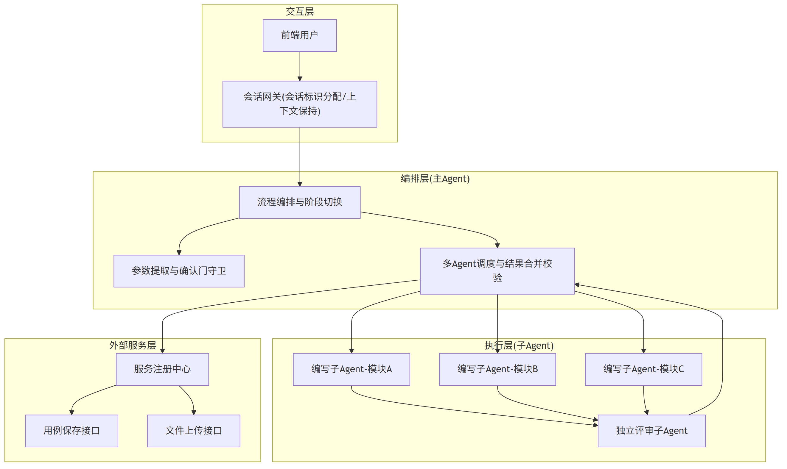
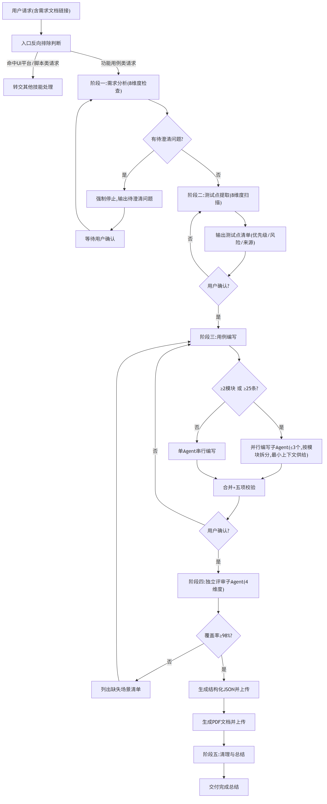

# 技术交底书

**案件名称**：一种基于多 Agent 编排与上下文隔离的测试用例自动生成方法及系统

**技术联系人**：
- 姓名：[待填写]
- 电话：[待填写]
- 邮箱：[待填写]

**专利类型**：发明

---

## 注意事项

（1）交底书应使代理人能看懂，尤其是背景技术和详细技术方案，一定要写得全面、清楚、完整；
（2）技术的公开程度，应以本领域普通技术人员不需付出创造性劳动即可进行实施为准。
（3）在与代理人沟通时，对于代理人咨询的技术问题，应给予回答并认真讲解，并且按要求及时正确地补充相应技术材料。

---

## 一、介绍相关技术背景，描述与本发明技术最相近的现有技术，并说明该现有技术存在的缺点

### 1.1 现有技术

本方案属于**软件测试自动化与人工智能辅助软件开发**交叉领域，具体涉及基于大语言模型（LLM）与多智能体（Multi-Agent）协作的**功能测试用例自动生成**技术。随着软件交付节奏加快，人工编写测试用例已成为研发链路中的瓶颈：测试工程师需要从需求文档中逐条提取测试点、设计边界值与异常场景、编写可执行的测试步骤，工作量大且质量依赖个人经验。利用大语言模型自动生成测试用例成为近年热点方向。

经检索（检索渠道：国家知识产权局中国专利公布公告站 epub.cnipa.gov.cn，使用 cnipa_epub_search.py 分多轮检索，检索词覆盖「多智能体 测试用例」「测试用例 自动生成」「大模型 测试用例」「上下文隔离 子任务」「用例评审 覆盖率」「会话隔离 多轮对话」「多智能体 评审 循环」等），按技术方向分类，与本案最相近的现有技术如下。

**方向一：多智能体协作生成测试用例**

1. **CN122633561A「联调测试方法、装置、设备、存储介质及产品」**
   - 技术方案：获取目标软件系统的变更需求信息，通过第一智能体结合测试知识库生成测试用例；通过第二智能体确定联调测试所需的模块调用拓扑并搭建测试环境；通过第三智能体在测试环境执行用例得到测试结果。
   - 应用场景：多业务模块系统的联调测试用例生成与执行。
   - 局限性：三个智能体按「生成—搭环境—执行」做功能分工，智能体间无上下文供给策略约束，未解决单智能体上下文过长导致后期产出质量下降的问题；无独立评审环节，用例质量依赖生成智能体自身能力，存在自我审查盲区。
   - 来源链接：http://epub.cnipa.gov.cn/patent/CN122633561A

2. **CN122633558A「一种基于标记语言的自动化测试用例生成方法及系统」**
   - 技术方案：获取原始测试需求文本，进行标记语言编写得到处理后的需求信息，基于操作指令、参数约束、流程逻辑及数据依赖确认流程拓扑图，进而确认目标测试场景与测试步骤序列，按环境准备步骤集、操作执行步骤集、结果校验步骤集生成子测试用例并汇总。
   - 应用场景：面向需求文档的自动化测试用例生成。
   - 局限性：单一流程串行生成，未涉及多 Agent 并行编排；无模块级上下文隔离；生成结果无独立评审与闭环校验；对大规模多模块需求，用例质量与效率受限于单次生成链路。
   - 来源链接：http://epub.cnipa.gov.cn/patent/CN122633558A

**方向二：多智能体上下文隔离与协同处理**

3. **CN122506934A「一种基于上下文隔离多智能体架构的无人机管控系统及方法」**
   - 技术方案：构建应用层（多个上下文完全隔离的任务智能体）、能力层（多个与应用层上下文隔离的能力智能体）、框架层（为智能体分配独立运行时容器与内存空间，不同智能体间仅通过隔离网关开放授权通信端口实现物理隔离）及外部工具层四级架构，通过三级上下文隔离机制将单一智能体承载的全链路管控任务拆分为多智能体分域承载模式，宣称单智能体上下文负载降低 90% 以上。
   - 应用场景：无人机集群管控等实时性、可靠性要求高的任务领域。
   - 局限性：上下文隔离采用**物理/运行时级隔离**（容器、内存、网关端口），面向实时管控场景；隔离粒度与本案的「信息供给级最小上下文」不同，且未涉及测试用例生成领域的任务拆分、编号隔离与产出合并校验，无评审闭环。
   - 来源链接：http://epub.cnipa.gov.cn/patent/CN122506934A

4. **CN122635406A「一种面向数据处理任务的多智能体框架及处理方法」**
   - 技术方案：构建含规划智能体、代码生成智能体和 SQL 生成智能体的多智能体系统，多智能体间采用分层反思的协同工作机制；规划智能体执行全局上下文检索，将复杂代码/SQL 生成与调试任务委托给独立智能体执行，通过分层反思机制动态调整任务规划，避免无限调试循环，通过上下文隔离与职责分离提升复杂数据处理任务的完成率。
   - 应用场景：数据处理、代码/SQL 生成与调试任务。
   - 局限性：面向数据处理任务，其「反思」是生成智能体自身的分层反思，并非独立评审角色的信息隔离审查；无覆盖率等量化判定标准与循环回补机制；未涉及测试用例生成及会话级状态管理。
   - 来源链接：http://epub.cnipa.gov.cn/patent/CN122635406A

5. **CN122470378A「一种面向大语言模型 Agent 工具调用的结构化数据上下文隔离寻址与多层缓存分析方法、装置及电子设备」**
   - 技术方案：调用数据获取工具获取结构化数据集合，基于数据集合索引 Key 并发启动多条相互独立的分析轨道，分析结果存储至持久化索引层与对象存储层并生成分析结果标识 Key，服务端基于各轨道标识 Key 自主读取并合并生成综合分析报告，解决上下文窗口污染、跨工具数据传递冗余、缓存机制缺失与断点续传问题。
   - 应用场景：LLM Agent 工具调用与数据分析。
   - 局限性：隔离对象是「数据轨道」而非「生成任务子 Agent 的上下文供给」，面向分析报告生成，与测试用例生成、独立评审闭环无直接关联。
   - 来源链接：http://epub.cnipa.gov.cn/patent/CN122470378A

6. **CN122633326A「一种基于国产软硬件环境的多智能体协同处理方法及系统」**
   - 技术方案：在国产处理器与操作系统环境下对多智能体任务统一规划，引入算子约束规则与算子支持映射表限制/替换模型结构，采用轻量级模型先行生成候选结果、主模型融合的双阶段生成方式，执行阶段按有向无环图形式的任务执行结构调用工具完成多智能体协作。
   - 应用场景：国产软硬件环境下的多智能体任务协同。
   - 局限性：关注算子级适配与任务依赖结构，未涉及测试用例领域的最小上下文供给、独立评审与确认门流程控制。
   - 来源链接：http://epub.cnipa.gov.cn/patent/CN122633326A

**方向三：AI 辅助测试用例评审与质量评估**

7. **CN122635311A「一种基于大模型的多维 AI 专家评审方法」**
   - 技术方案：切分评审规则压成评审标尺超盒簇，定位待评文件层级剥离证据形成证据粒元，驱动大模型专家角色审阅证据粒元形成专家意见粒元，通过改进的模糊最小最大神经网络模型压接同位边界、归并同源证据、标记边界冲突，经超盒咬合锁分机制执行牵引收缩与失格锁止，制成综合评审结果、证据回链关系与复核标记。
   - 应用场景：文件/证据类材料的智能评审。
   - 局限性：评审对象为文件与证据材料，评审机制为神经网络超盒模型；未涉及测试用例评审的「信息隔离」（刻意排除作者推理过程）思想，无覆盖率量化判定与回补循环。
   - 来源链接：http://epub.cnipa.gov.cn/patent/CN122635311A

8. **CN122220213A「一种软件自动化测试方法及系统」**
   - 技术方案：整合 UI、接口文档、测试用例和数据库文档，基于大模型生成测试数据得到数据库，在数据库中构建前置执行条件后对用例进行评审和修改得到新数据库，再结合 dump 文件进行分析，以解决用例质量不可控与测试用例提前校正问题。
   - 应用场景：软件自动化测试中用例数据准备与质量校正。
   - 局限性：评审与修改在**同一流程内**由同一条生成链路完成，属「自评自改」，无独立 Reviewer 角色与上下文裁剪；无覆盖率≥阈值的量化通过标准与循环评审机制。
   - 来源链接：http://epub.cnipa.gov.cn/patent/CN122220213A

9. **CN122086787A「基于标签树的 AI 辅助工具的评估方法及系统」**
   - 技术方案：针对 AI 辅助工具生成的每个测试用例创建来源标签对象及来源标签树，通过标签状态记录用例生成事件与评审事件的评估参数，在评审完成时基于第一、第二评估参数生成评估指标，统计周期结束时生成第二评估指标并输出评估结果。
   - 应用场景：AI 测试用例生成工具的效能评估。
   - 局限性：用于「工具效能评估」而非「用例质量闭环保障」，通过标签树事后统计，无评审通过前的回补循环，不改变用例本身的生成与评审流程。
   - 来源链接：http://epub.cnipa.gov.cn/patent/CN122086787A

**方向四：AI 测试与代码质量管理（相关）**

10. **CN122633543A「一种代码集成管理与自动化测试系统及方法」**
    - 技术方案：一体化工作流引擎监听代码仓库变更事件，并行触发传统质量检测流程与智能质量预测流程；智能质量预测模块提取多维度特征向量并利用机器学习模型生成质量风险分数/风险标签；智能资源调度器依据质量风险分数动态分配测试计算资源，并将风险分数集成至代码评审工具界面。
    - 应用场景：代码集成管理、质量风险预测与测试资源调度。
    - 局限性：围绕代码变更的质量预测与资源调度，未涉及测试用例的多 Agent 编排生成、评审闭环与流程确认门。
    - 来源链接：http://epub.cnipa.gov.cn/patent/CN122633543A

11. **CN122635843A「基于组件化配置驱动的数字员工多模式协同方法和系统」**
    - 技术方案：建立组件注册中心标准化组件，按配置需求加载组件，按工作模式创建差异化工作区，调用标准化组件处理并沿数据流实施安全防御，检测内容类型多模态渲染并分类存储，通过语义匹配引擎触发外部事件响应；提及精细化的会话隔离与高复用技能组合。
    - 应用场景：企业级数字员工（AI 服务）多模式协同。
    - 局限性：会话隔离为工作区级概念，未细化到「文件即状态 + 会话标识隔离 + 批次号追溯」的任务状态管理，也未涉及测试用例生成流程。
    - 来源链接：http://epub.cnipa.gov.cn/patent/CN122635843A

12. **CN122635349A「基于意图关系约束与执行反证闭环的意图识别方法」**
    - 技术方案：对用户输入进行语义识别得到多个候选意图，按意图关系约束重排得到意图组合结果，调用执行工具执行并判断是否触发反证行为，将反证信息作为后验信息调整候选意图并重排得到修正结果。
    - 应用场景：多轮对话场景下的意图识别与修正。
    - 局限性：其「反证闭环」针对对话意图识别，用于多轮对话中用户指代模糊的纠偏，与测试用例评审闭环在对象、判定标准与应用领域上均不同。
    - 来源链接：http://epub.cnipa.gov.cn/patent/CN122635349A

**检索总结**：上述现有技术分别覆盖了多智能体分工生成测试用例（CN122633561A）、标记语言用例生成（CN122633558A）、物理级上下文隔离（CN122506934A）、分层反思协同（CN122635406A）、AI 专家评审（CN122635311A）、自评自改用例校正（CN122220213A）、工具效能标签评估（CN122086787A）等方向，但**均未披露**「以信息供给级最小上下文隔离驱动多 Agent 并行编写、以独立 Reviewer 信息裁剪实现无偏见评审、以覆盖率阈值闭环回补、以强制确认门约束跨阶段推进、以会话隔离与文件即状态实现跨轮次可恢复」这一组合技术方案。

### 1.2 现有技术存在的缺点

综合上述检索结果，现有技术主要存在以下缺点：

1. **单 Agent 上下文过长导致后期产出质量下降**：现有生成方案（CN122633558A、CN122220213A 等）多由单一 Agent 或单一流程承载完整任务；当需求覆盖多模块、用例量较大时，上下文窗口被持续填充，后期生成的用例在步骤具体性、边界覆盖上质量显著下降。CN122506934A 虽提出上下文隔离，但采用容器/内存级物理隔离，面向实时管控领域，未给出面向「生成任务」的按模块拆分与最小上下文供给方案。

2. **AI 自我审查存在固有盲区**：现有评审方案（CN122220213A「自评自改」）由生成链路的同一角色完成评审，作者思维惯性使步骤模糊、数据缺失、覆盖率虚高等问题难以被发现；CN122635311A 的评审对象为文件证据，机制复杂且未针对测试用例，也未提出「刻意排除作者推理过程」的信息隔离评审思想。

3. **缺乏量化判定与闭环回补**：现有方案（CN122086787A 标签树评估）多为事后统计评估，无「覆盖率≥阈值→不通过则列出缺失场景→补充→重新评审」的循环机制，无法保证交付用例对测试点的覆盖。

4. **AI 跨阶段自主推进导致错误累积**：现有一次性串行/并行流程缺少跨阶段人类决策门，AI 在需求未澄清、测试点未确认的情况下继续向下推进，导致错误假设在后续阶段不断累积放大。

5. **多轮会话状态管理不完备**：现有方案（CN122635843A）的会话隔离为工作区级概念，未实现「会话标识隔离目录 + 文件即状态 + 批次号追溯」，跨轮次对话恢复、并发会话隔离、产出批次追溯能力不足；评审通过前即生成并上传结构化数据，存在脏数据风险。

---

## 二、针对上述缺点，说明本发明所要解决的技术问题

针对现有技术存在的上述缺点，本发明所要解决的技术问题包括：

1. **如何在大规模多模块需求下保持测试用例生成质量的稳定性**——通过按模块拆分任务并仅向每个编写子 Agent 供给该模块的最小上下文（需求片段 + 测试点 + 通用设计方法），使单 Agent 上下文长度可控、单模块思考深度提升，解决「上下文过长导致后期质量下降」问题。

2. **如何消除 AI 用例评审的自我审查盲区**——通过引入与编写角色完全分离的独立评审子 Agent，并对其上下文进行刻意裁剪（仅含需求原文片段 + 测试点清单 + 待评审用例，排除作者推理过程），实现无偏见的独立审查。

3. **如何以量化标准保障用例覆盖并形成闭环**——以「覆盖率 ≥ 98%」作为评审通过阈值，不通过时由评审方列出缺失场景清单（含场景描述、优先级、建议用例标题、测试数据示例），编写方补充后重新评审，循环直至通过；极难构造或低概率场景允许豁免但须说明原因。

4. **如何约束 AI 的跨阶段自主性**——在需求分析、测试点提取、用例编写、用例评审与上传各阶段之间设置强制确认门，AI 的自主性被约束在单阶段内，跨阶段决策权交还人类，避免错误累积。

5. **如何实现多轮会话的可恢复状态管理与数据质量保障**——以会话标识隔离临时目录、以文件即状态落盘各阶段产出，支持跨轮次恢复与并发会话隔离；以批次号串联同一批产出供后端追溯；仅在评审通过后才生成结构化数据并上传，避免脏数据入库。

---

## 三、本发明技术方案的详细阐述

### 3.1 背景

本方案应用于**基于大语言模型的功能测试用例自动生成**场景。系统通过对话式接口接收用户提供的需求文档（PDF/DOCX），依次完成需求分析、测试点提取、用例编写、用例评审与上传，最终交付「可评审用例 + 可上传结构化数据」双格式产物。

本方案的运行载体为部署于 AI 服务平台（会话网关）上的智能体实例，其特点包括：

- 前端通过会话网关发起对话，每个会话分配唯一会话标识，用于串联多轮对话；
- 智能体内部通过服务注册中心动态发现后端业务服务，完成用例与文档上传，不硬编码后端地址；
- 智能体只承担「编写功能测试用例」这一项职责，明确不涉及测试计划、测试策略、自动化脚本生成等，通过入口反向排除规则将非本领域请求（如 UI 测试平台元数据字段、创建 Web 测试脚本类句式）在进入流程前转交其他技能处理。

本方案的核心创新在于：**以「主 Agent 编排 + 子 Agent 执行」的多 Agent 组织架构，配合信息供给级上下文隔离、独立评审信息裁剪、覆盖率阈值闭环与强制确认门，将 AI 的创造力引导到单阶段深度执行上，把跨阶段决策权交给人类，从而在商业场景下获得可预期的产出质量。**

### 3.2 系统框图

系统整体划分为**交互层、编排层、执行层与外部服务层**四个层次，系统框图如下：

### 3.3 模块功能说明

**交互层**

- **前端用户**：以自然语言对话方式提出请求（如提供需求文档链接），并参与各阶段的确认门决策。
- **会话网关**：负责会话管理，为每个会话分配唯一会话标识并保持多轮对话上下文，是智能体与前端之间的唯一入口。

**编排层（主 Agent）**

- **流程编排与阶段切换**：将整个任务划分为需求分析、测试点提取、用例编写、用例评审与上传、清理总结五个阶段，按「阶段递进 + 人工确认门」方式组织，控制阶段间流转。
- **参数提取与确认门守卫**：从用户请求中提取关键参数（如需求文档地址、文件格式）；在待澄清问题未解决、测试点未确认、用例未确认、评审未通过时禁止进入下一阶段，强制等待用户决策。
- **多 Agent 调度与结果合并校验**：负责触发并行编写子 Agent、汇总各子 Agent 产出并对合并结果执行五项校验（编号唯一、覆盖率 100%、无冗余、模块完整、数据具体）；触发独立评审子 Agent 并依据其结论决定回补或放行。

**执行层（子 Agent）**

- **编写子 Agent（按模块拆分）**：每个编写子 Agent 仅接收其负责模块的需求片段、该模块测试点清单与通用测试设计方法，在隔离的上下文内编写该模块用例，写入独立文件，用例编号按模块标识隔离（如 `TC-模块A-001`）。
- **独立评审子 Agent**：与编写角色完全分离，其上下文刻意裁剪为「需求原文片段 + 测试点清单 + 待评审用例」三要素，不包含任何作者推理过程；按完整性、准确性、有效性、可执行性四个维度严格评审，输出覆盖率数据与明确「通过/不通过」结论。

**外部服务层**

- **服务注册中心**：提供后端服务实例的动态发现，从实例列表中筛选健康实例构建调用地址，实现环境无关、可移植的地址解析。
- **用例保存接口**：接收评审通过后的结构化用例 JSON 数据并入库。
- **文件上传接口**：接收评审报告、待澄清需求清单等 PDF 文档。

### 3.4 系统流程说明

系统整体流程如下：

**流程说明**：

- **入口反向排除**：识别到 UI 测试平台元数据字段（如 projectUid、folderUid、relativePath 等）或「创建 Web 测试脚本」类句式时，立即转交其他技能，不进入本流程——用「先排除」代替「后纠偏」，避免无效中间产物。
- **阶段一（需求分析）**：下载需求文档并按 8 维度框架（功能完整性、逻辑一致性、边界清晰度、可测试性、数据完整性、异常处理、依赖关系、性能要求）系统检查，标记明确/模糊/缺失；**有待澄清问题时强制停止**，禁止自动进入阶段二。
- **阶段二（测试点提取）**：按 8 维度（功能、数据、场景、非功能、组合、状态转换、并发、依赖）逐段提取测试点，每个测试点标注来源（需求段落）与优先级（0/1/2）及风险等级，需用户确认后才进入阶段三。
- **阶段三（用例编写）**：应用 8 种测试设计方法（等价类、边界值、判定表、因果图、状态迁移、场景法、正交试验、错误推测）加表单场景规则、集成场景规则编写用例；满足并行条件时按模块拆分并行执行（上下文隔离、编号隔离、独立文件），合并后执行五项校验。
- **阶段四（用例评审与上传）**：由独立评审子 Agent 按 4 维度评审；覆盖率 ≥98% 通过，否则列出缺失场景回补重审；通过后生成 JSON 并上传，生成 PDF 文档并上传。
- **阶段五（清理与总结）**：统一清理会话临时目录，输出完成总结（含用例统计与文档链接）。

#### 3.4.1 核心创新点一：基于最小上下文供给的并行编写编排

当测试点覆盖 ≥ 2 个模块或预估用例 ≥ 25 条时，主 Agent 启用并行编写：

1. **按模块拆分**：以测试点清单中的 `## [模块名称]` 为边界，将任务拆分为若干独立编写单元；
2. **最小上下文供给**：每个编写子 Agent 的上下文仅包含该模块需求片段、该模块测试点清单（含优先级与来源标注）、通用测试设计方法、用例字段定义四项内容，**不包含其他模块信息**——上下文越短，Agent 对该模块的思考越充分；
3. **编号防冲突**：用例编号格式为 `TC-[模块标识]-[序号]`，模块标识天然隔离编号空间；
4. **独立持久化**：每个编写子 Agent 写入独立 MD 文件，由主 Agent 统一合并；
5. **并行上限**：同时运行的编写子 Agent 不超过 3 个，超出部分串行排队；
6. **合并后五项校验**：编号唯一、覆盖率 100%（每个测试点均有用例覆盖）、无冗余（同一测试点不被多个用例重复覆盖）、模块完整（所有模块均已编写）、数据具体（抽查步骤使用了具体输入值而非模糊描述）。

#### 3.4.2 核心创新点二：基于信息裁剪的无偏见独立评审

1. **角色分离**：独立评审子 Agent 与编写子 Agent 完全分离，其角色为「独立测试用例评审专家」；
2. **上下文裁剪**：评审子 Agent 的上下文**只包含三样东西**——需求原文片段、测试点清单、待评审用例，**刻意排除主 Agent/编写子 Agent 写用例时的推理过程**，保证评审方无法以「作者视角」自我辩护，天然从「执行者」角度审视用例；
3. **四维度评审**：完整性（覆盖率 ≥98%，含正向/异常/边界场景）、准确性（预期结果与需求一致、数据具体、编号规范）、有效性（能发现缺陷、无冗余、原子性）、可执行性（步骤清晰、有具体输入值、前置可验证、可独立执行）；
4. **闭环循环**：不通过时评审方输出缺失场景清单（每条含场景描述、优先级、建议用例标题、测试数据示例），编写方补充用例后重新触发评审，循环直至通过；覆盖率不足 2% 的部分可豁免但必须说明豁免原因（极难构造环境、极低概率场景、需求未明确）。

#### 3.4.3 核心创新点三：强制确认门与阶段解耦

- 各阶段之间设有强制确认门：阶段一有待澄清问题禁止进入阶段二；阶段二测试点清单需用户确认；阶段三用例需用户确认；阶段四评审通过才触发上传；
- 设计目的：把 AI 的自主性约束在单阶段内，把跨阶段的决策权交给人类，避免「AI 假设答案继续往下走」导致的错误累积；
- 配套机制：方法论固化（需求分析 8 维度、测试点提取 8 维度、用例编写 8 种方法、用例评审 4 维度，将隐性测试经验显性化为可执行检查清单）与脚本固化（将下载、上传、格式转换等易错 IO 操作固化为独立脚本，剥离 Agent 的不确定性）。

#### 3.4.4 核心创新点四：会话隔离与文件即状态的跨轮次状态管理

- **会话标识隔离**：所有临时文件统一存放于以会话标识命名的隔离目录中，不同会话互不干扰，支持并发会话；
- **文件即状态**：不依赖内存状态，各阶段产出（需求文档、测试点清单、用例 MD、结构化 JSON）均落盘持久化，跨轮次对话可恢复；
- **批次号追溯**：生成 17 位批次号（年月日时分秒毫秒），同一批次的所有用例共享该批次号，便于后端追溯；
- **上传时机约束**：仅在评审通过后才生成结构化 JSON 并上传，避免「评审未通过就上传脏数据」；
- **统一清理**：流程结束统一清理会话目录，不残留中间文件。

### 3.5 关键技术参数

| 参数 | 含义 | 取值/约束 |
|------|------|-----------|
| 并行触发条件 | 启用并行编写的阈值 | 测试点覆盖 ≥ 2 个模块 或 预估用例 ≥ 25 条 |
| 并行上限 | 同时运行的编写子 Agent 数 | ≤ 3 个，超出串行排队 |
| 用例编号格式 | 用例唯一编号 | `TC-[模块标识]-[序号]` |
| 评审通过阈值 | 覆盖率达标线 | ≥ 98%（覆盖率 = 已覆盖测试点数 / 总测试点数 × 100%） |
| 豁免比例 | 允许未覆盖的比例 | < 2%，须说明豁免原因 |
| 评审维度 | 独立评审检查维度 | 完整性、准确性、有效性、可执行性（4 维） |
| 需求分析维度 | 需求文档检查框架 | 功能完整性等 8 维度 |
| 测试点提取维度 | 测试点扫描框架 | 功能、数据、场景等 8 维度 |
| 测试设计方法 | 用例编写方法论 | 等价类、边界值等 8 种 + 表单/集成规则 |
| 优先级 | 用例优先级 | 0（核心）、1（常用）、2（辅助/优化） |
| 批次号 | 批次标识 | 17 位数字（yyyyMMddHHmmssSSS） |
| 上传时机 | 数据入库时机 | 评审通过后 |

---

## 四、与现有技术相比，本发明具有哪些优点？

1. **用例质量稳定性显著提升**：通过按模块拆分 + 最小上下文供给，单 Agent 上下文长度可控，从根本上缓解「上下文过长导致后期用例质量下降」问题；编号隔离与合并后五项校验保证了多 Agent 产出的有序合并与全覆盖。对比 CN122633558A（单一链路串行生成）与 CN122506934A（物理级隔离、面向实时管控），本案为信息供给级隔离且直接服务于用例生成质量。

2. **评审无偏见、可量化、闭环化**：独立评审子 Agent 的上下文裁剪使评审方无法从作者视角自我辩护，克服了 CN122220213A「自评自改」的固有盲区；覆盖率 ≥98% 阈值 + 缺失场景清单 + 回补循环，使覆盖保障可量化、可迭代，优于 CN122086787A 的事后统计评估。

3. **AI 自主性与人类决策权平衡**：强制确认门将 AI 自主性约束在单阶段内，跨阶段决策权归人类，避免错误假设累积；方法论固化（8×4 框架）保证每次执行遵循同一标准，产出质量稳定可复现。

4. **状态管理完备、数据质量可控**：会话标识隔离 + 文件即状态支持跨轮次恢复与并发会话隔离；批次号支持后端追溯；「评审通过后才上传」避免脏数据入库，优于 CN122635843A 的工作区级会话隔离。

5. **环境无关、IO 可预期**：服务注册中心动态发现后端实例（不硬编码地址）；下载/上传/格式转换等易错 IO 固化为脚本（内置重试、编码处理、异常捕获），剥离 Agent 的不确定性；入口反向排除用「先排除」代替「后纠偏」，避免无效中间产物。

---

## 五、本发明的技术关键点和欲保护点

1. **基于最小上下文供给的并行用例编写方法**：按模块拆分测试用例生成任务，每个编写子 Agent 仅获得该模块的需求片段、测试点清单与通用设计方法，用例编号按模块标识隔离，合并后执行编号唯一、覆盖率 100%、无冗余、模块完整、数据具体五项校验（具体实现见 3.4.1）。

2. **基于信息裁剪的无偏见独立评审方法**：评审子 Agent 与编写角色分离，其上下文刻意裁剪为「需求原文片段 + 测试点清单 + 待评审用例」三要素（排除作者推理过程），按完整性、准确性、有效性、可执行性四维度评审（具体实现见 3.4.2）。

3. **基于覆盖率阈值的闭环回补方法**：以覆盖率 ≥98% 作为通过标准，不通过时由评审方输出缺失场景清单（含场景描述、优先级、建议用例标题、测试数据示例），编写方补充后重新评审直至通过；不足 2% 部分可豁免但须说明原因（具体实现见 3.4.2）。

4. **基于强制确认门的阶段解耦方法**：在需求分析、测试点提取、用例编写、评审上传各阶段间设置强制确认门，将 AI 自主性约束在单阶段内，跨阶段决策权交还人类，避免错误累积（具体实现见 3.4.3）。

5. **基于会话隔离与文件即状态的跨轮次状态管理方法**：以会话标识隔离临时目录、文件即状态落盘各阶段产出、批次号串联同一批产出、评审通过后才生成并上传结构化数据（具体实现见 3.4.4）。

6. **多 Agent 编排的整体系统**：主 Agent（流程编排、阶段切换、参数提取、确认门守卫、结果合并校验）与子 Agent（并行编写 ×N、独立评审）的组织架构，以及交互层、编排层、执行层、外部服务层的层次化系统结构（见 3.2、3.3）。

---

## 六、其它（实施例、技术效果、参数示例）

### 实施例：多模块业务系统的功能测试用例生成

**应用场景**：某业务系统包含用户管理、订单管理、支付模块三个功能模块，需求文档提供 PDF 格式，要求生成覆盖全部模块的功能测试用例。

**已知条件**：
- 需求文档：单一 PDF，包含三个模块的功能描述、表单字段定义与业务规则；
- 测试点规模：三个模块共提取约 30 个测试点，预估用例数 ≥25 条，满足并行触发条件；
- 运行环境：AI 服务平台上的智能体实例，通过会话网关接入，后端服务通过服务注册中心发现。

**系统流程简述**：
1. 用户通过对话提供需求文档链接，会话网关分配会话标识；
2. 入口反向排除判断为功能用例类请求，进入阶段一：下载需求文档并按 8 维度分析，输出维度评估表与关键业务规则；本实施例需求无待澄清问题，进入阶段二；
3. 阶段二按 8 维度提取 30 个测试点（含优先级与来源标注），用户确认后进入阶段三；
4. 阶段三检测到 3 个模块、预估 30 条用例，启用并行编写：三个编写子 Agent 分别获得「用户管理 / 订单管理 / 支付模块」的最小上下文（模块需求片段 + 模块测试点 + 通用设计方法），并行编写并写入独立文件，用例编号分别为 `TC-User-001…`、`TC-Order-001…`、`TC-Pay-001…`；主 Agent 合并后执行五项校验通过；
5. 阶段四独立评审子 Agent 仅接收「需求原文 + 测试点清单 + 合并用例」，按 4 维度评审；若覆盖率 96%（某支付边界场景缺失），输出缺失场景清单（含建议用例标题「验证支付金额超出单笔限额提示」与测试数据示例「单笔限额 5000 元，输入 5000.01 元」），编写子 Agent 补充后重新评审至覆盖率 100%；
6. 评审通过后生成结构化 JSON（含批次号）上传至用例保存接口，生成评审报告 PDF 上传至文件上传接口；
7. 阶段五清理临时目录，输出完成总结。

**技术效果**：
- 三个模块用例由三个上下文隔离的编写子 Agent 并行产出，单 Agent 上下文仅包含单模块信息，用例步骤具体性抽查通过率明显高于单 Agent 串行生成的后期用例；
- 独立评审发现并回补了支付边界场景缺失，最终覆盖率 100%，评审通过；
- 全程跨阶段决策（测试点确认、用例确认、评审结论）均由用户/评审门把关，无错误假设跨阶段累积；
- 会话中断后可从已落盘的阶段产出恢复继续，无需重新开始。

**参数设置示例**（不作为权利要求限制）：
- 并行触发阈值：模块数 ≥2 或预估用例 ≥25 条；
- 并行上限：3 个；
- 评审通过阈值：覆盖率 ≥98%；
- 豁免上限：<2%；
- 批次号：17 位（yyyyMMddHHmmssSSS）；
- 用例编号：`TC-[模块标识]-[序号]`。